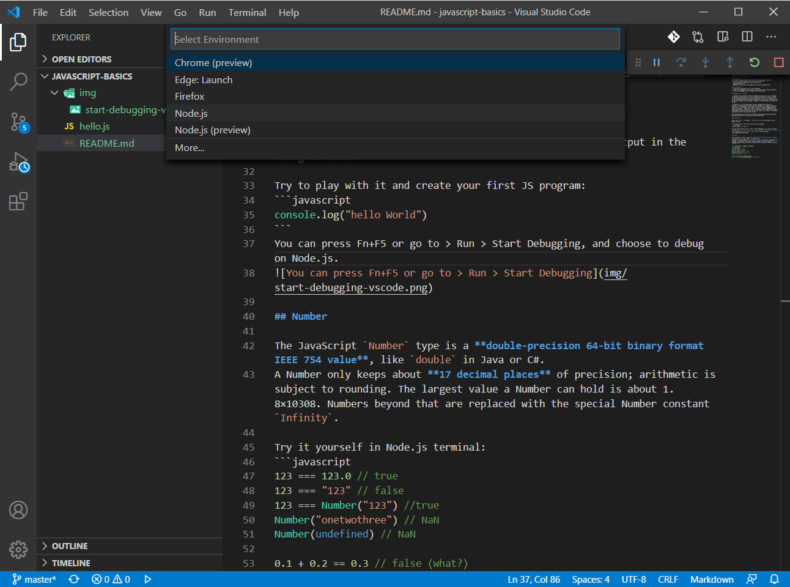

# Welcome to JavaScript Basics

## Learning Objectives

In this tutorial, you will learn:
+ The basic synax (grammer) of JavaScript
+ Understand JavaScript data types: Number, String, Boolean, Object, Function, null, and undefined

## Pre-requisite
This tutorial guide assumes you have the following pre-requisite:
+ A general understanding of the Internet and the Web
+ Some programming experience and understanding.
+ Installed [Node.js]
+ Managed to follow the [environment set-up and configuration].

## Instructions
1. Clone this repository to your own workspace.
2. Open the repository in your IDE (I used Visual Studio Code by default).
3. Follow this README file to complete the instruction.

## JavaScript in a Glance

> JavaScript was created in 1995 by Brendan Eich while he was an engineer at Netscape. JavaScript was first released with Netscape 2 early in 1996. It was originally going to be called LiveScript, but it was renamed in an ill-fated marketing decision that attempted to capitalize on the popularity of Sun Microsystem's Java language — despite the two having very little in common.

> JavaScript is a multi-paradigm, dynamic language with types and operators, standard built-in objects, and methods. Its syntax is based on the Java and C languages — many structures from those languages apply to JavaScript as well. JavaScript supports object-oriented programming with object prototypes, instead of classes. JavaScript also supports functional programming — because functions are objects that can be stored in variables and passed around like any other object.

More information can be found [here](https://developer.mozilla.org/en-US/docs/Web/JavaScript/A_re-introduction_to_JavaScript). 

## Hello World

Just like `print()` in Python, `console.log()` will send output in the debug console.

Try to play with it and create your first JS program:
```javascript
console.log("hello World")
```
You can press Fn+F5 or go to > Run > Start Debugging, and choose to debug on Node.js.
***Step 1:***

***Step 2:***

***Step 3(result):***


## Number

The JavaScript `Number` type is a **double-precision 64-bit binary format IEEE 754 value**, like `double` in Java or C#.
A Number only keeps about **17 decimal places** of precision; arithmetic is subject to rounding. The largest value a Number can hold is about 1.8×10308. Numbers beyond that are replaced with the special Number constant `Infinity`.

Try it yourself in Node.js terminal:
```javascript
123 === 123.0 // true
123 === "123" // false
123 === Number("123") //true
Number("onetwothree") // NaN
Number(undefined) // NaN

0.1 + 0.2 == 0.3 // false (what?)
0.1 + 0.2 == 0.30000000000000004 // surprise!

```

## Operators

First let's look at arithmetic operators, for example:

|Operator |	Name          | Example | Result
|----------------| ----------------- | ---------------- | ----------------
|+        |	Addition      |	6 + 9  | 15 
|-        |	Subtraction	  | 20 - 15 | 5
|*        |	Multiplication| 3 * 7 | 21
|/        |	Division      | 10 / 5 | 2

